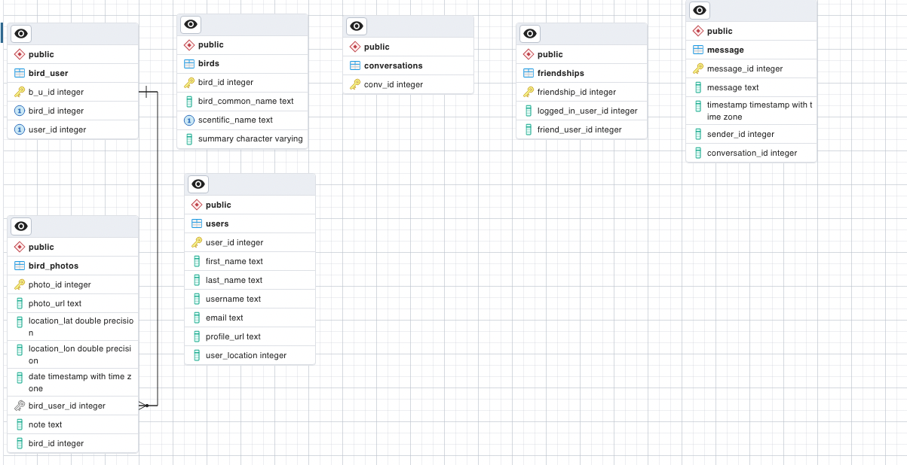
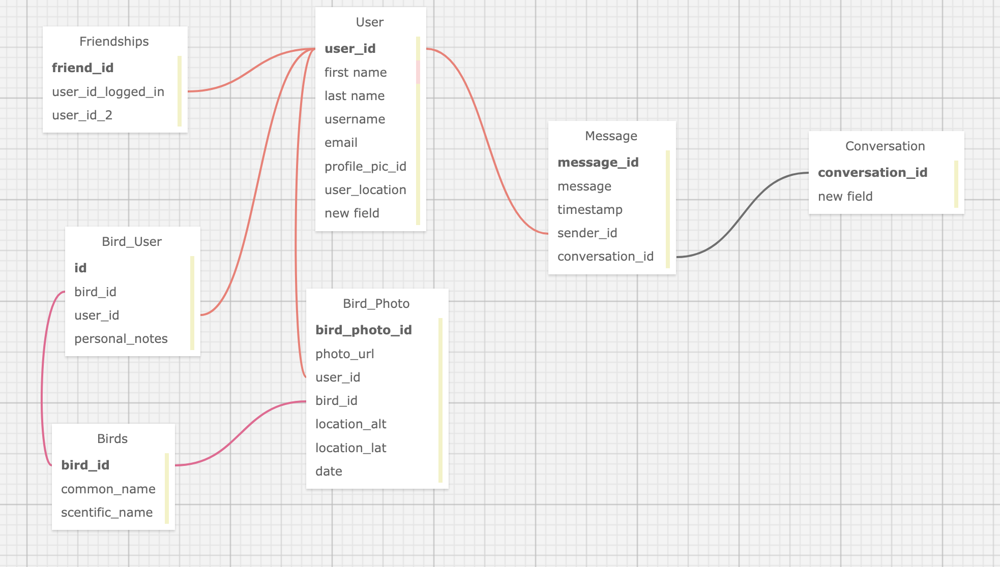

**<h1>Birder</h1>**

**<h2 style="text-decoration:underline;">Overview:</h2>**

Designed for birdwatching enthusiasts, Birder allows birdwatchers to keep track of when and where they have sighted a bird and to socialize via chat with other birdwatchers.

**<h2 style="text-decoration:underline;"> Table of Contents:</h2>**

* [Tech Stack and External APIs](#-tech-stack-and-external-apis)
* [App description](#-app-description)
* [Database organization](#database)
* [How to start and run the app](#-how-to-start-and-run-the-app-)
* [Issues and To-Dos](#-issues-and-to-dos-)

**<h2> Tech Stack and External APIs:</h2>**
The app utilizes the following tech stack:

The app utilizes the following APIs:
* Auth0 for Google Account login
* Cloudinary for to generate urls of uploaded photos
* Integrated Taxonomic Information System to retrieve the scientific name of the birds, which in turn is used to access the
* Wikipedia api to retrieve the summary of the bird to populate the bird detail description.

**<h2 style="text-decoration:underline;"> App Description</h2>**
The user should be able to access this app from the browser utilizing their Google account.

The user should be able to search for and add friends, based off of name or proximity. The user should also be able to initiate and conduct a real-time chat with a friend.

The user should be able to see all of the birds they've previously viewed and access their notes and additional information about that bird.

** Page Organization**
The app is organized into the following pages:
* Authentication
* Welcome page:
    * Account page
    * Bird cards
        * Bird detail
        * Record a bird sighting
* Friends
    * Add friends
        * Chat with friends

** Login and Account Creation:**

A user should be able to access this app from the browser, utilizing their Google account to login to the app.
After logging in the first time, the user is directd to the Account page in which they are prompted to enter their name, email address, zip code and a username or handle. Submitting this form will create a new user in the app's database and will allow the user to begin socializing and recording bird sightings.

If the user already exists, after logging in, they will see the Welcome page from which they can choose:
    - Update Account: allows the user to alter account information
    - Log Out
    - My Birds: access the user's record of their bird sightings
    - My Friends: see their friends (other app users) and initiate a chat
    - Discover a Bird: this will display a random bird from within the database

If the user selects 'Update Account', it will display the account information page that they would have seen when creating their account.

** Bird Cards and Bird Detail:**
When the user spots a bird, they should be able to record that sighting. The app is designed for users that already know the common names of birds that they may encounter. However, when entering a bird's name the field should suggest other bird names based on what the user has already have typed. These suggested bird names should be all the previously spotted birds across all users. The user can also add notes about the bird and a date the bird was seen, upload a picture of the bird, and choose the location this occurred either by using the device's location or by entering in a location name or address.

After adding a bird sighting, the user is able to see a record of all the types of birds they've previously spotted in the form of 'bird cards' which include a picture and the scientific name of the birds. The user can adjust the organization of the birds displayed either alphabetically or by date.

Upon clicking on a bird card, the user can see additional information about that bird, including a wikipedia style summary about that the bird, the user's previous notes and pictures, and a map displaying all of the locations that user has seen the bird.

** Add a Friend and Chat:**
When the user clicks on 'My Friends', they should be taken to a page of their existing friends and/or be allowed to search for friends based on their name. The user can then add the friend to their list.

When the user clicks on a friend, they should be taken to a chat app that will allow them to have a chat with that friend in real-time.

** Discover a Bird:**
The user has the option of "Discovering a Bird" which will take them to a page with a picture of that bird and its corresponding bird detail information. The bird shown should be randomly selected from all of the birds in the database, not just the user's specific birds.

**<h2>Database:</h2>**
The database is designed as follows:

The following diagram demonstrates the relationships between the tables. Note that some of the column names have been updated since this diagram was generated, although the underlying structure remains the same:

**<h2> How to start and run the app: </h2>**
Installation
* npm install
* npm run start for webpack
* npm run server for server
* current dependencies inlcude

"@babel/core": "^7.20.2"

"@babel/preset-env": "^7.20.2"

"@babel/preset-react": "^7.18.6"

"babel-loader": "^9.1.0"

"body-parser": "^1.20.1"

"cors": "^2.8.5"

"css-loader": "^6.7.2"

"dotenv": "^16.0.3"

"express": "^4.18.2"

"nodemon": "^2.0.20"

"react": "^18.2.0"

"react-dom": "^18.2.0"

"style-loader": "^3.3.1"

"webpack": "^5.75.0"

"webpack-cli": "^5.0.0"

"webpack-dev-server": "^4.11.1"

**<h2> Issues and To Dos: </h2>**
Below is a list of known issues with the app and proposed fixes and/or yet-to-be-built functionalities:
1. Users do not currently have the option to log-in without Google
2. The 'bird detail' should be displayed as a single page, rather than a card that flips, in part due to difficulty this may pose to photo-sensitive users, but also for ease of site navigation.
    * The bird sightings map should be centered in a location that averages sightings
    * User should be able to scroll through past notes and pictures
3. The 'Add a bird' form:
    * form is visually confusing
    * form should include data validation so the user cannot submit a blank bird record
    * Currently, the photo upload is non-functional
4. 'My Friends':
    * friends should be suggested based on proximity
    * There should be an 'add a friend' button, rather than pressing enter
5. Chat functionality is currently nonfunctional due to missing column 'users_hash'
6. 'Discover a Bird' would be enhanced by the addition of more unique bird information, including perhaps a recording of the bird's call. This funcitonality was investigated and found possible to impliment utilizing the xenocanto api, but was not included due to time constraints.
7. Identifying a bird based on its common name is a particular challenge. I was unable to find a bird-specific database accessible via an API that would reliably facilitate that search. THe best bird identification APIs were in fact based on a bird's call, which apparently have very unique and identifiable tones and rhythms. As a result, I researched taxonomic databases extensively. While I found one based out of the Europe that allowed me to filter results by the bird class, 'aves', the differences in the common names of birds across cultures did not reliably identify birds, particularly North American species which were outside the focus of the taxonomic organization. Finally, I chose the ITIS which is backed by the US Geological Society and the Smithsonian Institution. Unfortunately, the API search for a species by common name cannot be constrained to the class 'aves'. In other words, entering 'crow' may return a 'CROWn starfish'. In order to prevent this from happening, this app would greatly benefit from a pre-seeded list of common North American birds.

